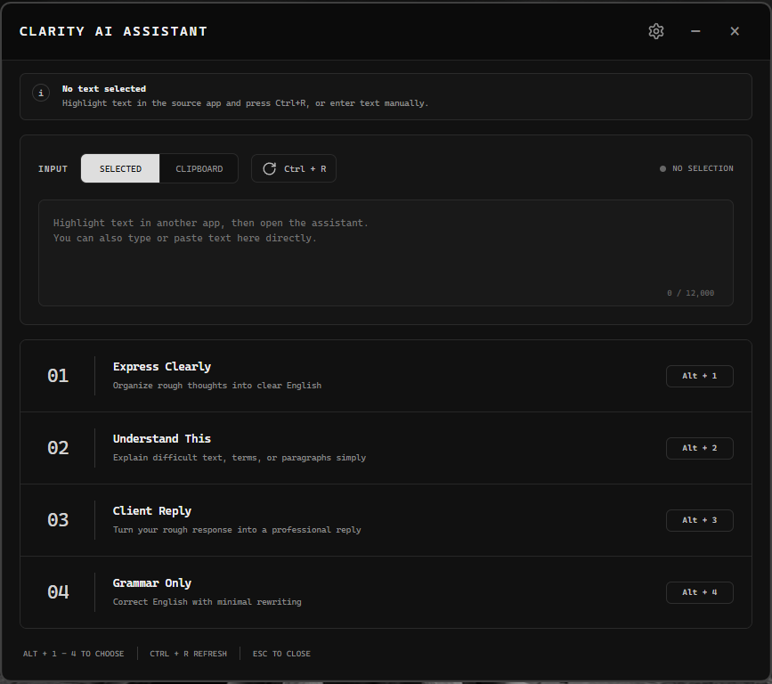
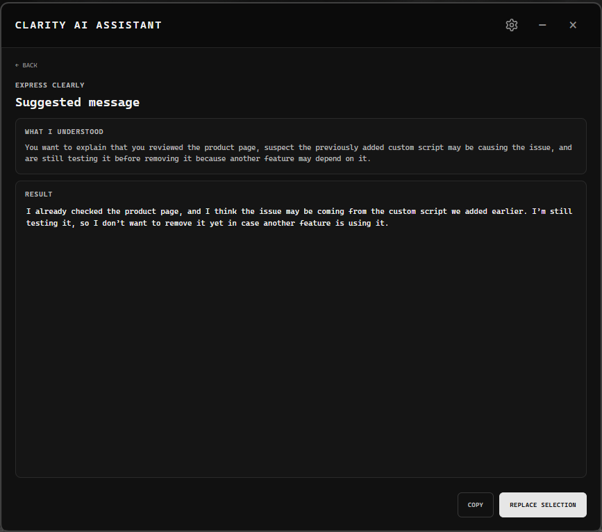
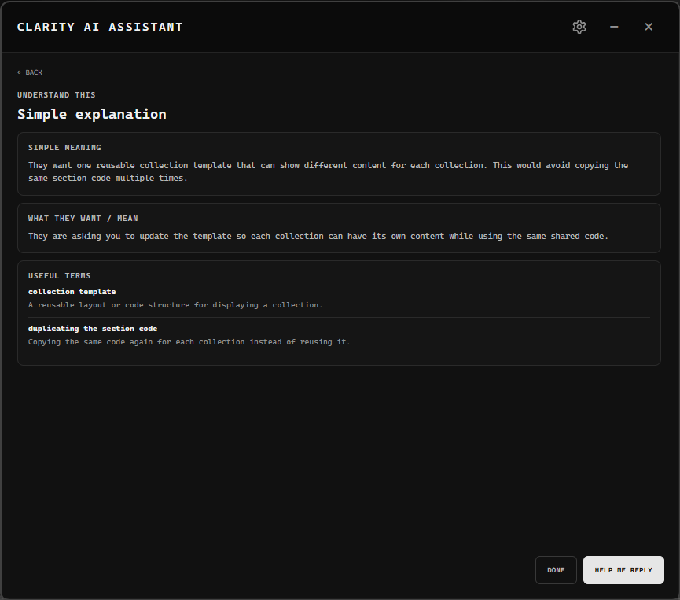
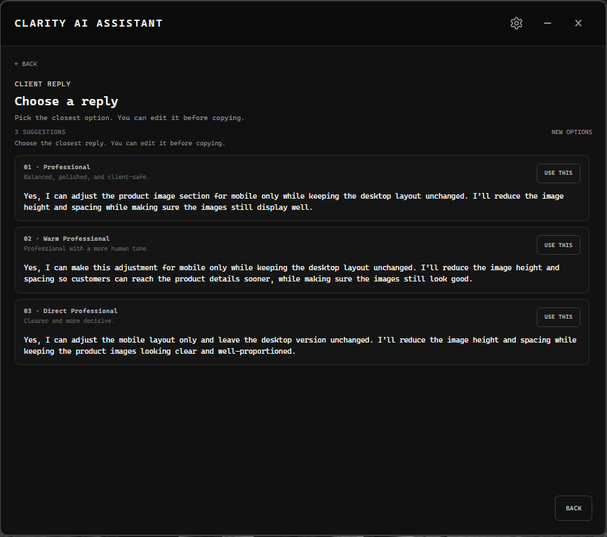

# Clarity AI Assistant

**A Windows desktop AI writing assistant for clearer everyday and professional communication.**

Clarity is a personal portfolio project built with **Electron, JavaScript, Cloudflare Workers, and the OpenAI API**. It works directly with selected text in Windows applications so users can rewrite, understand, correct, or reply to text without constantly moving content between apps.

**Current version:** `1.0.7`

---

## Preview



---

## What Clarity Can Do

### Express Clearly

Turn rough thoughts, incomplete sentences, Taglish, or unclear English into a cleaner and more natural message while preserving the intended meaning.



### Understand This

Break down difficult client messages, technical wording, or unfamiliar terms into a simpler explanation.



### Client Reply

Turn a client message and an optional rough response into multiple professional reply options that can be reviewed and edited before sending.



### Grammar Only

Correct grammar, spelling, punctuation, and minor awkward wording while keeping the original structure and tone as close as possible.

### Replace Selection

After reviewing a result, Clarity can return the approved text directly to the selected editable text in the source application.

Replace Selection is intended for editable controls such as:

- textareas and text inputs;
- Facebook/browser composers;
- Notepad;
- VS Code and other editors.

It cannot modify static webpage content, already-sent messages, or other read-only text.

---

## Tech Stack

| Area                 | Technology                                |
| -------------------- | ----------------------------------------- |
| Desktop application  | Electron                                  |
| Application language | JavaScript                                |
| UI                   | HTML, CSS, JavaScript                     |
| AI backend           | Cloudflare Workers                        |
| AI service           | OpenAI API                                |
| Update delivery      | Electron Updater + Cloudflare Worker + R2 |
| Windows integration  | PowerShell + Win32 APIs                   |
| Packaging            | Electron Builder + NSIS                   |
| Version control      | Git + GitHub                              |

---

## Global Shortcuts

Clarity uses a compact `Ctrl + Alt` shortcut cluster.

| Shortcut         | Action             |
| ---------------- | ------------------ |
| `Ctrl + Alt + Q` | Open Assistant     |
| `Ctrl + Alt + W` | Quick Express      |
| `Ctrl + Alt + E` | Quick Understand   |
| `Ctrl + Alt + R` | Quick Client Reply |
| `Ctrl + Alt + T` | Quick Grammar      |

The shortcuts are editable from Clarity's **Shortcuts & Settings** panel.

### Modifier-hold workflow

Clarity supports keeping `Ctrl + Alt` held while tapping action keys:

```text
Hold Ctrl + Alt

W → Express
E → Understand
R → Client Reply
T → Grammar
Q → Open Assistant
```

The selected-text capture system safely handles the held modifiers instead of requiring the user to release the full shortcut chord immediately.

---

## Selected-Text Capture

On Windows, Clarity uses a persistent PowerShell helper to capture selected text efficiently.

The capture flow is designed to:

- preserve the user's clipboard;
- wait only for the shortcut action key when modifiers remain held;
- safely neutralize held modifiers during the internal copy operation;
- restore modifier state afterward;
- remember the last valid external source window;
- fall back to a one-shot capture path if the persistent helper is unavailable.

Clarity does **not** continuously record keystrokes.

---

## Multi-Monitor Behavior

Clarity positions itself on the display where the shortcut is invoked.

For reliability:

- same-monitor openings reuse the existing Electron window;
- cross-monitor openings recreate the BrowserWindow when needed;
- the renderer uses a frame-ready handshake to avoid stale content and visual flashes.

The small additional delay during a cross-monitor switch is intentional.

---

## Architecture

```text
Source application
      │
      │ selected text
      ▼
Clarity AI Assistant
Electron desktop app
      │
      ├── Writing request
      │       ▼
      │   Cloudflare Worker
      │   mickofy-writing-assistant
      │       ▼
      │   OpenAI API
      │
      └── Update check
              ▼
          Cloudflare Worker
          clarity-updates-gateway
              ▼
          Cloudflare R2
          installer + blockmap + latest.yml
```

The desktop application does not store the AI provider secret directly in renderer code.

---

## Project Structure

```text
clarity-ai-assistant/
├─ build/
│  └─ icon.ico
│
├─ docs/
│  └─ images/
│     ├─ clarity-home.png
│     ├─ clarity-express.png
│     ├─ clarity-understand.png
│     └─ clarity-client-reply.png
│
├─ src/
│  ├─ main.js
│  ├─ preload.js
│  └─ renderer/
│     ├─ index.html
│     ├─ renderer.js
│     ├─ styles.css
│     └─ update-about.css
│
├─ cloudflare/
│  ├─ mickofy-writing-assistant/
│  │  └─ worker.js
│  │
│  └─ clarity-updates-gateway/
│     └─ worker.js
│
├─ package.json
├─ package-lock.json
├─ .gitignore
└─ README.md
```

The two Cloudflare Workers remain separate because they serve different responsibilities:

- `mickofy-writing-assistant` handles writing and AI requests;
- `clarity-updates-gateway` protects and serves the desktop update feed.

---

## Requirements

Development currently targets:

- Windows 10/11;
- Windows x64;
- Node.js;
- npm;
- PowerShell;
- internet access for AI requests and update checks.

---

## Install Dependencies

```powershell
npm install
```

---

## Desktop Environment Variables

The Electron main process reads the following environment variables:

```text
WRITING_API_URL
WRITING_APP_TOKEN
CLARITY_UPDATE_URL
CLARITY_UPDATE_TOKEN
```

### Purpose

| Variable               | Purpose                                                        |
| ---------------------- | -------------------------------------------------------------- |
| `WRITING_API_URL`      | URL of the writing-assistant Cloudflare Worker                 |
| `WRITING_APP_TOKEN`    | Token used by the desktop app to authenticate writing requests |
| `CLARITY_UPDATE_URL`   | Update gateway URL                                             |
| `CLARITY_UPDATE_TOKEN` | Token used to authenticate update requests                     |

Do not commit production tokens or secrets to GitHub.

---

## Cloudflare Secrets

Keep secrets in Cloudflare Worker environment bindings/secrets rather than hardcoding them into `worker.js`.

Do not commit values such as:

```text
API keys
application tokens
update tokens
private credentials
```

Recommended ignored local files include:

```gitignore
.env
.env.*
!.env.example

.dev.vars
.dev.vars.*
```

---

## Run in Development

```powershell
npm start
```

In development mode, automatic updates are intentionally disabled.

A healthy startup should include:

```text
Auto-update disabled in development mode.
Persistent selected-text capture helper is ready.
```

---

## Build Windows Installer

```powershell
npm run build
```

The Windows x64 build is produced with Electron Builder and NSIS.

Expected release artifacts include:

```text
dist/
├─ Clarity AI Assistant Setup 1.0.7.exe
├─ Clarity AI Assistant Setup 1.0.7.exe.blockmap
└─ latest.yml
```

`dist/` remains outside source control.

---

## Automatic Updates

Clarity uses `electron-updater` with a Cloudflare update gateway.

The update flow is:

```text
Installed Clarity
      ↓
checks latest.yml through update gateway
      ↓
compares installed version with latest version
      ↓
downloads the matching installer
      ↓
verifies the update metadata/checksum
      ↓
user chooses Restart Update
      ↓
new version is installed
```

### `latest.yml`

`latest.yml` is the update manifest generated by Electron Builder.

It tells installed copies of Clarity:

- the latest application version;
- the installer filename;
- file size;
- SHA-512 checksum;
- release metadata.

Do not manually edit the generated `latest.yml` unless there is a specific reason.

### Cloudflare R2 release order

When publishing a new version, upload in this order:

```text
1. Clarity AI Assistant Setup <version>.exe
2. Clarity AI Assistant Setup <version>.exe.blockmap
3. latest.yml
```

Upload `latest.yml` **last**, because replacing it announces the new release to installed copies of Clarity.

Keep the previous release artifacts temporarily until the new update has been tested end-to-end.

---

## Release Workflow

Example patch release:

```powershell
git status

npm version patch --no-git-tag-version

git add .
git status
git diff --cached

git commit -m "Release 1.0.7"
git push

npm run build
```

Build only after the release source has been committed so the generated installer corresponds to the exact code stored in GitHub.

After building:

1. upload the new `.exe` to Cloudflare R2;
2. upload the matching `.blockmap`;
3. replace `latest.yml` last;
4. launch the previously installed version;
5. confirm the update is detected;
6. choose **Restart Update**;
7. confirm the new version launches;
8. smoke-test shortcuts and Replace Selection.

---

## Security and Privacy

Clarity is built around a small Electron security boundary:

- `contextIsolation: true`;
- `nodeIntegration: false`;
- renderer sandbox enabled;
- privileged Electron functionality exposed through the preload bridge;
- writing and update endpoints protected by application tokens;
- AI/provider secrets belong in backend environment secrets;
- no continuous keystroke logging;
- clipboard contents are restored after internal capture operations when possible;
- results remain reviewable/editable before being copied or returned to the source application.

Never commit `.env`, `.dev.vars`, API keys, tokens, or other credentials.

The repository history was also checked with Gitleaks before being made public.

---

## Git

Before committing:

```powershell
git status
git diff
```

Stage changes:

```powershell
git add .
```

Review exactly what is staged:

```powershell
git status
git diff --cached
```

Then commit and push:

```powershell
git commit -m "Describe the change"
git push
```

---

## Current v1.0.7 Highlights

Version `1.0.7` includes major reliability and workflow improvements, including:

- five customizable global shortcuts;
- Quick Express;
- Quick Understand;
- Quick Client Reply;
- Quick Grammar;
- persistent selected-text capture helper;
- modifier-hold-aware shortcut capture;
- remembered source-window fallback;
- improved multi-monitor window handling;
- action-specific loading states;
- improved Client Reply workflow;
- reliable Replace Selection;
- native Windows paste injection;
- preservation of maximized browser window state after replacement;
- private Electron auto-update flow through Cloudflare;
- Clarity-styled update dialog.

---

## Development Notes

The selected-text capture and Replace Selection paths interact directly with Windows focus, clipboard, keyboard, and window state. Changes to those systems should be tested carefully in at least:

```text
Notepad
VS Code
a Chromium browser
Facebook/browser composer
same-monitor usage
cross-monitor usage
```

For shortcut testing, also verify:

```text
Hold Ctrl + Alt
tap W / E / R / T / Q
release Ctrl + Alt
confirm normal keyboard state afterward
```

---

## Author

**Micko**

Clarity AI Assistant is a personal desktop productivity project focused on clearer professional communication and practical Windows-native workflows.
